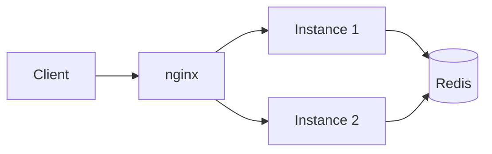
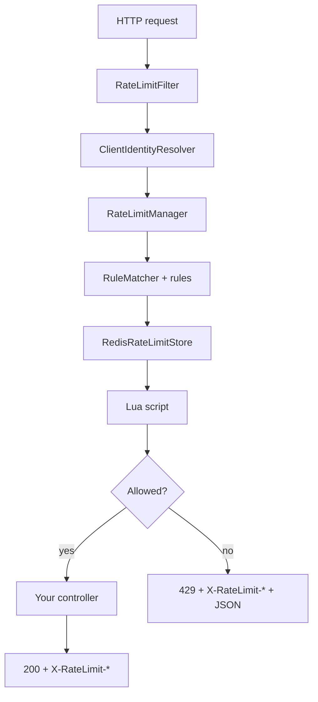

# Distributed Rate Limiter

A distributed HTTP rate-limiting layer for Spring Boot applications. Counter state is centralized in Redis and evaluated atomically via Lua scripts, enabling horizontally scaled deployments to enforce a single, consistent quota behind a load balancer.

**Java 21** · **Spring Boot 4** · **Redis 7** · **nginx** · **Docker Compose**

---

## Overview

Rate limiting is enforced at the servlet filter boundary, prior to controller dispatch. Each request is classified by client identity (user ID, IP address, or API key), matched against a configurable rule set, and evaluated against shared Redis-backed counters. Permitted requests proceed with standard `X-RateLimit-*` response headers; rejected requests receive HTTP 429 with `Retry-After` and a structured JSON error payload.

Distributed correctness is achieved through atomic read-modify-write operations in Redis Lua scripts, eliminating race conditions under concurrent load and ensuring counter consistency across application replicas.



Each replica executes an identical enforcement pipeline. The load balancer distributes ingress traffic and propagates `X-Forwarded-For` for accurate client IP resolution.

## Quick start

**Requirements:** Docker and Docker Compose

```bash
cd core
docker compose up --build -d

# wait for the stack
until curl -sf -o /dev/null http://localhost/test; do sleep 2; done

# send a request
curl -si -H "X-User-Id: demo-user" http://localhost/test
```

| Service | Port | Role |
|---------|------|------|
| nginx | 80 | Load balancer → [http://localhost](http://localhost) |
| app-1, app-2 | 8080 (internal) | Spring Boot replicas |
| redis | 6379 | Shared counter state |

```bash
# stop
docker compose down

# reset all counters
docker compose exec -T redis redis-cli FLUSHDB
```

---

## How it works



1. **Identify** the client from headers (`X-User-Id`, `X-API-Key`, `X-Forwarded-For`, or JWT `sub`).
2. **Match** rules by scope, endpoint pattern, and `enabled` flag.
3. **Check** each matching rule against Redis (token bucket or sliding-window counter).
4. **Respond** with quota headers on success, or a full 429 contract on denial.

All matching rules must pass. On denial, the first failing rule (in config order) determines the response. On success, headers reflect the tightest remaining quota.

### Redis keys

```
rl:{ruleName}:{scopeKey}

rl:user-limit:user:alice
rl:ip-limit:ip:203.0.113.5
rl:endpoint-limit:api-key:sk-demo-key
rl:global-limit:global
```

---

## Features

| | |
|---|---|
| **Distributed state** | Redis + atomic Lua scripts |
| **Algorithms (Redis)** | Token bucket, sliding-window counter |
| **Algorithms (in-memory)** | Fixed window, sliding log, sliding counter, token bucket, leaky bucket |
| **Scopes** | Global, per-user, per-IP, per-API-key, per-endpoint, per-user-endpoint |
| **Client identity** | `X-User-Id`, `X-API-Key`, `X-Forwarded-For`, Bearer JWT `sub` |
| **Endpoint rules** | Ant-style patterns (`/api/**`) |
| **HTTP contract** | `X-RateLimit-Limit`, `Remaining`, `Reset`; `Retry-After` + JSON on 429 |
| **Enforcement** | Servlet filter; optional `@RateLimited` AOP |
| **Failure handling** | Fail-closed (503) or fail-open when Redis is down |

### Default rules (Docker profile)

| Rule | Scope | Limit |
|------|-------|-------|
| `user-limit` | User | 50 req / min |
| `endpoint-limit` | API key | 10 burst, 1/sec refill — `/api/**` only |
| `ip-limit` | IP | 30 req / min |
| `global-limit` | Global | 100 burst, 10/sec refill |

Defined in `core/src/main/resources/application-docker.yaml`.

---

## Try it

### Successful request

```bash
curl -si -H "X-User-Id: demo-user" http://localhost/test
```

```http
HTTP/1.1 200
X-RateLimit-Limit: 50
X-RateLimit-Remaining: 49
X-RateLimit-Reset: 1719494460
```

### Hit the limit

```bash
docker compose exec -T redis redis-cli FLUSHDB

for i in $(seq 1 55); do
  curl -s -o /dev/null -w "hit %{http_code} remaining=%{header:X-RateLimit-Remaining}\n" \
    -H "X-User-Id: demo-user" http://localhost/test
done
```

```http
HTTP/1.1 429
X-RateLimit-Limit: 50
X-RateLimit-Remaining: 0
X-RateLimit-Reset: 1719494502
Retry-After: 42
Content-Type: application/json

{"error":"rate_limit_exceeded","message":"Rate limit exceeded for rule 'user-limit'.","retryAfterSeconds":42}
```

### API key (scoped to `/api/**`)

```bash
curl -si -H "X-API-Key: sk-demo-key" http://localhost/api/data
```

### Per-IP limiting

```bash
docker compose exec -T redis redis-cli FLUSHDB

for i in $(seq 1 35); do curl -s -o /dev/null http://localhost/test; done
curl -si http://localhost/test | head -15
```

### Inspect counters in Redis

```bash
docker compose exec -T redis redis-cli KEYS 'rl:*'
```

---

## Configuration

```yaml
rate-limit:
  store: redis              # redis | memory
  failure-mode: closed      # closed → 503 when Redis unavailable | open → allow through
  redis:
    host: redis
    port: 6379
    timeout-millis: 50
  rules:
    - name: user-limit
      scope: USER
      algorithm: sliding-counter
      maxRequests: 50
      windowMillis: 60000
      enabled: true
      endpointPattern: /api/**   # optional
```

Rules load from YAML at startup. Restart the app (or rebuild containers) after changing them.

| Algorithm | Required fields |
|-----------|-----------------|
| `token` | `capacity`, `refillPerSecond` |
| `sliding-counter` | `maxRequests`, `windowMillis` |

---

## Development

### Project structure

```
core/
├── docker-compose.yaml
├── Dockerfile
├── nginx/
└── src/main/java/com/ratelimiter/core/
    ├── config/       # properties, Redis, filter beans
    ├── controller/   # sample endpoints
    ├── identity/     # client resolution
    ├── service/      # rule evaluation
    ├── store/        # Redis / in-memory backends
    ├── strategy/     # in-memory algorithms
    └── web/          # filter, response writer, AOP
```

### Tests

```bash
cd core

# unit tests
./mvnw test -Dtest='RuleMatcherTest,ClientIdentityResolverTest,JwtPayloadDecoderTest,RateLimitResponseWriterTest'

# full suite (requires Docker for Redis integration tests)
./mvnw test
```

---

## What's next

The current release loads rule definitions from YAML at startup; configuration changes require a redeploy. The next iteration introduces **runtime rule management**: an authenticated Admin REST API for CRUD operations on rate-limit rules, with definitions persisted in Redis and propagated to all replicas through pub/sub hot reload. Operators will be able to adjust limits on a live cluster without restarting application instances.

Subsequent work will add **operational visibility** — Prometheus metrics export, Grafana dashboards for allow/reject rates and Redis latency, and load-test harnesses to validate enforcement under concurrent traffic.

---
